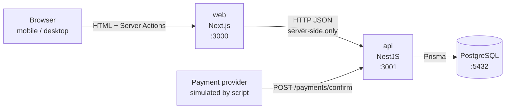

# 01 — Architecture

## Big picture



- **The browser never calls the API directly.** The Next.js server renders the page and runs the order action, and that's what calls the API. So there's no CORS setup, and the API address stays internal.
- **PostgreSQL is the only source of truth for stock.** There's no cache in between (see README → Caching).

## Folder structure

```
noahs-kiosk/
├── docker-compose.yml          # db + api + web, one command
├── docs/                       # these design docs
├── api/                        # NestJS backend
│   ├── Dockerfile
│   ├── prisma/
│   │   ├── schema.prisma       # database design as code
│   │   ├── migrations/         # generated SQL + hand-written CHECK constraints
│   │   └── seed.ts             # demo menu (only if the table is empty)
│   ├── scripts/simulate-payment.ts   # plays the payment provider
│   ├── src/
│   │   ├── main.ts             # starts the app, validation, Swagger at /docs
│   │   ├── app.module.ts
│   │   ├── common/
│   │   │   ├── prisma/         # PrismaService (like a DbContext)
│   │   │   ├── decorators/     # @IdempotencyKey() reads the header
│   │   │   └── validation.ts   # global validation → 400 VALIDATION_FAILED
│   │   └── modules/
│   │       ├── menu/           # GET /menu
│   │       ├── orders/         # POST /orders
│   │       └── payments/       # POST /payments/confirm
│   └── test/
│       ├── support/            # test DB setup + helpers
│       ├── orders/             # concurrency tests
│       └── payments/           # idempotency tests
└── web/                        # Next.js frontend
    ├── Dockerfile
    ├── app/
    │   ├── page.tsx            # menu page (Server Component)
    │   ├── actions.ts          # Server Action: place order → API → refresh()
    │   ├── error.tsx           # shown when the API is down
    │   └── layout.tsx
    ├── components/
    │   ├── order-form.tsx      # quantity + Order button + messages (client)
    │   └── auto-refresh.tsx    # refreshes the page every 5 s (client)
    └── lib/
        ├── api.ts              # server-only: getMenu()
        ├── messages.ts         # every customer message (see 04-ui-states.md)
        ├── format.ts           # ฿ price, short order number
        └── types.ts
```

Each backend module has the same shape:
```
orders/
├── orders.controller.ts
├── orders.module.ts
├── commands/place-order/       # one folder per endpoint
│   ├── place-order.request.ts  # body + validation rules  (≈ Request + FluentValidator)
│   ├── place-order.command.ts  # message for the mediator (≈ MediatR IRequest)
│   ├── place-order.handler.ts  # calls the manager         (≈ MediatR Handler)
│   └── place-order.response.ts # what the API returns       (≈ Response)
├── managers/orders.manager.ts
└── repositories/orders.repository.ts
```

## Backend layers

The same idea as my .NET modular architecture, without a Service layer:

```
Controller  →  Handler  →  Manager  →  Repository  →  PrismaService
  (HTTP)      (mediator)  (business)  (one query)      (DbContext)
```

| Layer | Its one job | Never |
|---|---|---|
| **Controller** | Turn the HTTP request into a command and send it | contain logic |
| **Request** | Validation rules as decorators (`@IsInt() @Min(1) @Max(10)`), checked before the controller runs | touch the DB |
| **Handler** | Call the manager, shape the response | contain business rules |
| **Manager** | Business rules; **opens the transaction** | build HTTP responses |
| **Repository** | One database query per method | make decisions |

**Where does new code go?**
- About routes or status codes → Controller
- About input (required, min, max) → Request
- A business rule (stock, order status, amount check) → Manager
- A database query → Repository
- Calling an outside system (a real payment provider) → a new `clients/` folder, called by the Manager

**Transactions.** The Manager runs `prisma.$transaction(async (tx) => …)` and passes `tx` into each repository call, like a Unit of Work in EF Core. If anything throws inside, everything rolls back.

**Why no Service layer?** Here it would only pass calls from Manager to Repository. Add one when two managers need the same logic (e.g. a `PricingService` shared by Orders and a future Refunds module).

**Is CQRS needed?** No. `@nestjs/cqrs` is used **only as a mediator** (like MediatR): one handler per use case, one-line controllers. No event sourcing, no separate read/write databases. Removing it would take about 10 minutes (controllers call managers directly).

**Who owns which table.** Each table has exactly one module that writes SQL for it:

| Module | Table | Shared with other modules |
|---|---|---|
| menu | `menu_item` | `MenuRepository`: Orders uses it to reserve stock |
| orders | `orders`, `order_line` | `OrdersRepository`: Payments uses it to mark an order paid |
| payments | `payment_event` | — |

## Error handling

There's no try/catch in handlers. Code throws a NestJS exception with a stable `code`, and NestJS's global exception filter turns it into the HTTP response (like exception middleware in .NET). Unexpected errors become a 500.

```json
{ "statusCode": 409, "code": "OUT_OF_STOCK", "message": "Only 0 left of Matcha Latte", "menuItemId": 3, "name": "Matcha Latte", "available": 0 }
```

| code | HTTP | When |
|---|---|---|
| `VALIDATION_FAILED` | 400 | bad body or header (missing field, quantity out of range) |
| `MENU_ITEM_NOT_FOUND` | 404 | the item doesn't exist |
| `OUT_OF_STOCK` | 409 | not enough stock (`available` says how many are left) |
| `ORDER_NOT_FOUND` | 404 | payment confirmation for an unknown order |

The frontend picks the customer message from the `code`, never from the English text.

The one try/catch in the project is in `OrdersManager`. It turns a specific database error (two requests with the same idempotency key at once) into "return the order that won". That's the rule: only catch an error if you *do something different* with it.

## API

| Endpoint | Body | Success | Errors |
|---|---|---|---|
| `GET /menu` | — | 200 `[{ id, name, priceCents, stock }]` | — |
| `POST /orders` | `{ lines: [{ menuItemId, quantity }] }` + optional `Idempotency-Key` header | 201 `{ orderId, status, totalCents, createdAt, lines }`. Same key again → 201 with the **same** order. | 400, 404, 409 |
| `POST /payments/confirm` | `{ eventId, orderId, amountCents }` | 200 `{ result, orderId, orderStatus, note? }`, where `result` is `APPLIED`, `DUPLICATE` or `IGNORED` | 400, 404 |

Payment confirmations get 200 even for duplicates: the provider keeps retrying until it sees a success response.

Try them in Swagger: http://localhost:3001/docs

## The core code, layer by layer (place order)

Shortened from the real files.

```ts
// orders.controller.ts: no logic
@Post()
place(@Body() body: PlaceOrderRequest, @IdempotencyKey() key: string | undefined) {
  return this.commandBus.execute(new PlaceOrderCommand(body.lines, key));
}

// orders.manager.ts: business rules + transaction
async placeOrder(lines, idempotencyKey?) {
  if (idempotencyKey) {                       // a retry? hand back the existing order
    const existing = await this.ordersRepository.findByIdempotencyKey(this.prisma, idempotencyKey);
    if (existing) return existing;
  }
  return this.prisma.$transaction(async (tx) => {
    for (const line of normalizeLines(lines)) {   // merged + sorted by id (no deadlocks)
      const reserved = await this.menuRepository.tryDecrementStock(tx, line.menuItemId, line.quantity);
      if (!reserved) throw new ConflictException({ code: 'OUT_OF_STOCK', ... }); // rolls back everything
    }
    return this.ordersRepository.create(tx, { idempotencyKey, totalCents, lines });
  });
}

// menu.repository.ts: one query, no decisions
async tryDecrementStock(db: Tx, id: number, quantity: number): Promise<boolean> {
  const { count } = await db.menuItem.updateMany({
    where: { id, stock: { gte: quantity } },   // WHERE id = $1 AND stock >= $2
    data: { stock: { decrement: quantity } },  // SET stock = stock - $2
  });
  return count === 1;
}
```

## Frontend, in Angular terms

| Next.js | Closest Angular idea |
|---|---|
| `app/page.tsx` (a file = a route) | a route in `app.routes.ts` |
| **Server Component** (the default) | no real equivalent: runs **only on the server**, can `await` data directly, sends plain HTML |
| `'use client'` component | a normal Angular component (state, events, runs in the browser) |
| **Server Action** (`'use server'`) | a service method, except it runs on the server and a `<form>` can call it directly |
| `useActionState` | the form's result + a "loading" flag, without writing a store |
| `refresh()` / `router.refresh()` | re-run the route's data loading and re-render, without a page reload |
