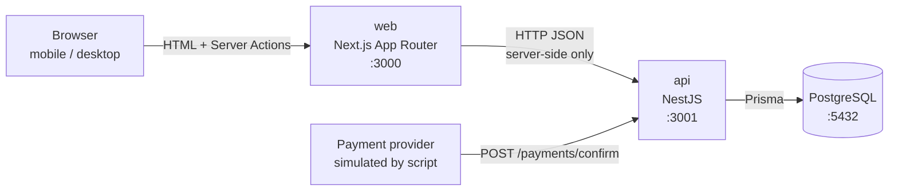

# 01 — Architecture

## Big picture



- The **browser never calls the API directly.** The Next.js server renders the menu and runs Server Actions, and those call the API. That means no CORS setup, and the API URL stays internal.
- **PostgreSQL is the single source of truth** for stock. There is no cache layer (see README → Caching).

## Repository layout

```
noahs-kiosk/
├── README.md              # how to run, decisions, trade-offs, next steps
├── CLAUDE.md              # rules for AI-assisted work in this repo
├── docker-compose.yml     # db + api + web, one command
├── docs/                  # design docs (this folder)
├── api/                   # NestJS backend
│   ├── prisma/
│   │   ├── schema.prisma  # DB design as code
│   │   ├── migrations/    # generated SQL (+ hand-added CHECK constraints)
│   │   └── seed.ts        # demo menu (only inserts when table is empty)
│   ├── scripts/
│   │   └── simulate-payment.ts   # acts as the payment provider
│   ├── src/
│   │   ├── main.ts
│   │   ├── app.module.ts
│   │   ├── common/prisma/        # PrismaService (DbContext equivalent)
│   │   └── modules/
│   │       ├── menu/
│   │       │   ├── menu.controller.ts
│   │       │   ├── menu.module.ts
│   │       │   ├── queries/get-menu/        # GetMenuQuery + GetMenuHandler
│   │       │   ├── managers/menu.manager.ts
│   │       │   └── repositories/menu.repository.ts
│   │       ├── orders/
│   │       │   ├── orders.controller.ts
│   │       │   ├── commands/place-order/    # Command + Handler + Request + Response
│   │       │   ├── managers/orders.manager.ts
│   │       │   └── repositories/orders.repository.ts
│   │       └── payments/
│   │           ├── payments.controller.ts
│   │           ├── commands/confirm-payment/   # Command + Handler + Request + Response
│   │           ├── managers/payments.manager.ts
│   │           └── repositories/payments.repository.ts
│   └── test/              # integration tests against a real Postgres
└── web/                   # Next.js frontend
    ├── app/
    │   ├── layout.tsx
    │   ├── page.tsx       # menu page (Server Component)
    │   ├── error.tsx      # shown if the menu can't be loaded (API down)
    │   └── actions.ts     # Server Action: placeOrder → API → refresh()
    ├── components/
    │   ├── order-form.tsx    # 'use client' — quantity + Order button
    │   └── auto-refresh.tsx  # 'use client' — router.refresh() polling
    └── lib/
        ├── api.ts         # server-only fetch helpers (getMenu)
        ├── types.ts       # API shapes + OrderResult
        ├── format.ts      # ฿ price, short order id
        └── messages.ts    # error code → customer-friendly message (see 04-ui-states.md)
```

## Backend layers (4 layers)

Same idea as the .NET modular architecture, minus the pass-through Service layer:

```
Controller  →  Handler  →  Manager  →  Repository  →  PrismaService (DbContext)
 (HTTP)        (mediator)   (business)   (data access)
```

| Layer | .NET equivalent | Its one job | Must NOT |
|---|---|---|---|
| **Controller** | Controller | Map HTTP to a Command/Query, then `commandBus.execute()` | contain any logic |
| **Request DTO** | Request + FluentValidator | Shape and validate input (`class-validator` decorators, run by the global `ValidationPipe`) | touch the DB |
| **Handler** | MediatR Handler | Call the manager, shape the Response | contain business rules |
| **Manager** | Manager | Business rules, **owns the transaction boundary** | build HTTP responses |
| **Repository** | Repository | One Prisma query per method, no decisions | know about HTTP or business rules |

**Where does new code go? Ask:**
- "Is it about HTTP (route, status code)?" → Controller
- "Is it about input shape (required, min, max)?" → Request DTO
- "Is it a business rule (stock, state transition, amount check)?" → Manager
- "Is it a SQL query?" → Repository
- "Is it calling an external system (a real payment provider)?" → add a `clients/` folder; the Manager calls the client

**Transactions:** the Manager opens `prisma.$transaction(async (tx) => …)` and passes `tx` into repository methods. This is the same idea as a Unit of Work in EF Core: all repository calls inside share one DB transaction.

### Why no Service layer (and when to add one)
Without a Service layer, **all business logic lives in the Manager**: stock rules, the order total, payment state transitions, the amount check. The Repository only runs queries.

In this project a Service would be pure pass-through (`manager → service.x() → repo.x()`), which is extra code to read and explain with no extra meaning. **Add a `services/` folder when a piece of logic is reused by 2+ managers** (e.g. a `PricingService` used by both Orders and a future Refunds module). It isn't needed today.

### Module boundaries: who owns what
| Module | Owns table(s) | Exports |
|---|---|---|
| `menu` | `menu_item` | `MenuRepository` (stock read + atomic decrement) |
| `orders` | `orders`, `order_line` | `OrdersRepository` (order lookup + status update) |
| `payments` | `payment_event` | — |

Orders doesn't write `menu_item` with its own query. It calls `MenuRepository.tryDecrementStock(tx, …)`, imported from `MenuModule`. Each table has exactly one module that writes SQL for it, so "where is stock changed?" has one answer.

### Use-case folder (Handler + Request + Response)
Each endpoint gets one folder, the same set of files as in .NET:
```
commands/place-order/
├── place-order.command.ts    # the message sent on the CommandBus (like a MediatR IRequest)
├── place-order.request.ts    # HTTP body DTO + validation rules (≈ Request + FluentValidator)
├── place-order.response.ts   # response shape (≈ Response)
└── place-order.handler.ts    # @CommandHandler (≈ MediatR Handler)
```
**Validator:** in NestJS the rules go *on the Request class* as decorators (`@IsInt() @Min(1) @Max(10) quantity`). The global `ValidationPipe` runs them before the controller method is called, which is the same effect as a FluentValidation pipeline behaviour. Invalid input never reaches the Handler, and the client gets a 400 with the failed rules.

### Error handling: no try/catch in handlers
NestJS has a **global exception filter**, the same idea as .NET's exception-handling middleware:
- Code anywhere throws `ConflictException({ code: 'OUT_OF_STOCK', ... })` → the filter turns it into HTTP 409 with that JSON body.
- Any unexpected error → HTTP 500 and it's logged. Nothing leaks.
- When a Manager throws inside `$transaction`, Prisma **rolls back automatically**.

So Handlers stay clean. Only use try/catch where you'd **do something different** with the error (e.g. translate a specific DB error into a business error), never just to re-throw or log.

Every error response has a stable **`code`**, so the frontend maps codes to friendly messages instead of parsing English text:
```json
{ "statusCode": 409, "code": "OUT_OF_STOCK", "message": "Only 0 left of Iced Latte", "menuItemId": 3, "available": 0 }
```
| code | HTTP | When |
|---|---|---|
| `VALIDATION_FAILED` | 400 | bad body (missing field, quantity out of range) |
| `MENU_ITEM_NOT_FOUND` | 404 | item id doesn't exist |
| `OUT_OF_STOCK` | 409 | not enough stock for the requested quantity (`available` included) |
| `ORDER_NOT_FOUND` | 404 | payment confirmation for an unknown order |

### Is CQRS required? No
We use `@nestjs/cqrs` **only as a mediator** (CommandBus/QueryBus → Handler), the same role MediatR plays in .NET. We do **not** use the "big CQRS" parts: no separate read/write databases, no event sourcing, no sagas.

- **Why keep it:** controllers stay one line, each use case is one Handler file, and it's the pattern I already think in.
- **Trade-off:** one more level of indirection. The alternative is the controller calling `manager.placeOrder()` directly, which would also be fine for 3 endpoints. If the team prefers fewer layers, removing it means deleting the Handlers and pointing controllers at the managers (about 10 minutes).

## Example: Place order, layer by layer

```ts
// Controller — no logic
@Post()
place(@Body() body: PlaceOrderRequest) {
  return this.commandBus.execute(new PlaceOrderCommand(body.lines));
}

// Handler — calls manager, shapes response
@CommandHandler(PlaceOrderCommand)
export class PlaceOrderHandler implements ICommandHandler<PlaceOrderCommand> {
  constructor(private readonly manager: OrdersManager) {}
  async execute(cmd: PlaceOrderCommand) {
    const order = await this.manager.placeOrder(cmd.lines);
    return { orderId: order.id, status: order.status, totalCents: order.totalCents };
  }
}

// Manager — business rules + transaction
async placeOrder(lines: OrderLineInput[]) {
  return this.prisma.$transaction(async (tx) => {
    for (const line of sortById(mergeDuplicates(lines))) {
      const reserved = await this.repo.tryDecrementStock(tx, line.menuItemId, line.quantity);
      if (!reserved) throw new ConflictException(`Item ${line.menuItemId} is out of stock`);
    }
    // ...create order + lines with price snapshot
  });
}

// Repository — one query, no decisions
async tryDecrementStock(tx: Tx, id: number, qty: number): Promise<boolean> {
  const { count } = await tx.menuItem.updateMany({
    where: { id, stock: { gte: qty } },     // WHERE id = $1 AND stock >= $2
    data: { stock: { decrement: qty } },    // SET stock = stock - $2
  });
  return count === 1;
}
```

## API endpoints

| Method | Path | Purpose | Success | Errors |
|---|---|---|---|---|
| GET | `/menu` | List items with price and stock | 200 `[{ id, name, priceCents, stock }]` | — |
| POST | `/orders` | Place an order `{ lines: [{ menuItemId, quantity }] }`, optional header `Idempotency-Key` | 201 `{ orderId, status: "PENDING", totalCents }` (also 201 with the **same order** when the key was already used) | 400 `VALIDATION_FAILED`, 404 `MENU_ITEM_NOT_FOUND`, 409 `OUT_OF_STOCK` |
| POST | `/payments/confirm` | Called by the payment provider `{ eventId, orderId, amountCents }` | 200 `{ result: "APPLIED" \| "DUPLICATE" \| "IGNORED" }` | 400 `VALIDATION_FAILED`, 404 `ORDER_NOT_FOUND` |

Why `/payments/confirm` answers **200 even for duplicates**: providers retry until they get a 2xx. A duplicate isn't an error, it's the provider doing its job, so we confirm we have it and the retries stop.

## Frontend (Next.js App Router), in Angular terms

| Next.js | Angular equivalent |
|---|---|
| `app/page.tsx` folder-based route | route in `app.routes.ts` |
| Server Component (default) | no direct equivalent: a component that runs **only on the server**, can `await fetch()` directly, and ships no JS |
| `'use client'` component | a normal Angular component (runs in the browser, has state and events) |
| Server Action (`'use server'` function) | a service method that calls the backend, except it runs on the server and the form can call it directly |
| `refresh()` (in a Server Action) | "re-run the resolver and re-render this route" |
| `router.refresh()` | re-fetch the server-rendered data without a full reload |
