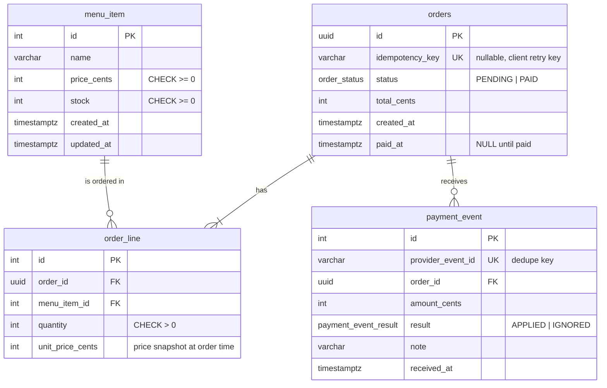

# 02 — Database design (PostgreSQL)

Four tables. The schema lives in `api/prisma/schema.prisma`; the generated SQL (plus hand-written CHECK constraints) is in `api/prisma/migrations/`.

## ER diagram

## Conventions

### Naming: `snake_case` in the database, `camelCase` in TypeScript
- Tables and columns are `snake_case` (`menu_item.price_cents`). PostgreSQL **folds unquoted names to lowercase**, so `PriceCents` would have to be written `"PriceCents"` (with quotes) in every query. snake_case is the Postgres community standard and avoids that.
- TypeScript code uses `camelCase` (`menuItem.priceCents`). Prisma maps between the two with `@map("price_cents")` / `@@map("menu_item")`, the same as EF Core's `[Column("price_cents")]`.
- Table names are singular (`menu_item`, `order_line`), except `orders`, because `order` is a reserved word.

### Time: always UTC (`timestamptz`)
- **`timestamptz` is not a column name.** It's the actual PostgreSQL **type**, short for `timestamp with time zone`. Columns are still named `created_at`, `paid_at`, etc.
- The two Postgres types:

  | Type | Stores | Problem / benefit |
  |---|---|---|
  | `timestamp` (without time zone) | wall-clock text like `2026-10-04 14:30`, **no zone** | Ambiguous: 14:30 in Bangkok or London? Depends on whoever wrote it. |
  | `timestamptz` | converts the input **to UTC** on save, returns it as an exact instant | Unambiguous. The same moment everywhere. |

  (It doesn't store the original zone. It normalizes to UTC. Closest MSSQL comparison: `datetime2` vs `datetimeoffset`, except Postgres keeps no offset, only the UTC instant.)
- Every timestamp column is `TIMESTAMPTZ(3)` (`@db.Timestamptz(3)` in Prisma).
- API JSON returns ISO-8601 UTC (`2026-10-04T07:30:00.000Z`).
- Converting to local time is a **display concern**: the UI formats it in the kiosk's timezone. Correct for a global company, and nothing changes if a kiosk opens in another country.

### Audit columns: `created_at` / `updated_at` yes, `created_by` / `updated_by` not yet
- There's no authentication (out of scope by the brief), so there's no user to record. A `created_by` column would always be NULL or a fake value.
- When admin screens or staff logins arrive, add `created_by` / `updated_by` (user id FK) in a migration. That's a non-breaking change because the columns are nullable.
- The payment audit trail we *do* need already exists: `payment_event` records every distinct confirmation and what we did with it.

## Design decisions per table

### `menu_item`
- **`price_cents INT`, not DECIMAL/FLOAT.** Money is stored in minor units (satang). Integer maths is exact, and it avoids Prisma's `Decimal` object type.
- **`stock INT CHECK (stock >= 0)`.** The app already prevents overselling with a conditional UPDATE. The CHECK constraint is a second safety net: even a buggy future code path can't push stock below zero. Prisma's schema can't express CHECK, so it's added by hand to the migration SQL.

### `orders`
- Named `orders` because `order` is a reserved SQL word.
- **`id UUID`.** It's sent to the payment provider and shown (shortened) as the order number, so it shouldn't be guessable or reveal how many orders we have.
- **`status` enum, `PENDING → PAID` only.** The state machine only moves forward, which is what makes late or out-of-order confirmations safe (see 03-flows.md).
- **Stock is reserved at order time** (status PENDING), not at payment time. The customer at the kiosk must know right away whether they got the last item.
- **`idempotency_key VARCHAR UNIQUE NULL`.** The client sends the same key when it retries an order after a timeout. If an order with that key already exists, the API returns it instead of creating a second one (see 03-flows.md §4). It's nullable so API callers without a key still work. Postgres allows many NULLs in a UNIQUE column.

### `order_line`
- **`quantity CHECK (quantity > 0)`**, also hand-written in the migration.
- **`unit_price_cents` snapshot.** If the menu price changes later, old orders still show what the customer actually paid.

### `payment_event`
- **`provider_event_id UNIQUE`** is the idempotency key. The same confirmation arriving twice hits the unique index, and the insert does nothing (`ON CONFLICT DO NOTHING`).
- Every *distinct* event is stored, including ignored ones (e.g. a second, different event for an already-paid order, or an amount mismatch), with a `note`. That gives an audit trail: "why didn't this payment apply?"

## Indexes
| Index | Why |
|---|---|
| PKs | default |
| `payment_event(provider_event_id)` UNIQUE | dedupe, and the lookup on every webhook |
| `orders(idempotency_key)` UNIQUE | order retry lookup; stops two orders with the same key |
| `order_line(order_id)` | load an order's lines |
| `payment_event(order_id)` | load an order's payment history |

## MSSQL ↔ PostgreSQL notes (for me)
| MSSQL | PostgreSQL |
|---|---|
| `INT IDENTITY(1,1)` | `SERIAL` / `INT GENERATED … AS IDENTITY` (Prisma: `@default(autoincrement())`) |
| `UNIQUEIDENTIFIER` + `NEWID()` | `UUID` + `gen_random_uuid()` |
| `DATETIME2` | `TIMESTAMP(3)` |
| `MERGE` / `IF NOT EXISTS INSERT` | `INSERT … ON CONFLICT DO NOTHING` |
| Default isolation READ COMMITTED (locking) | Default READ COMMITTED (MVCC; an UPDATE waits on the row lock, then re-checks the WHERE against the new row) |
