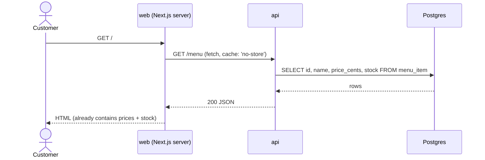
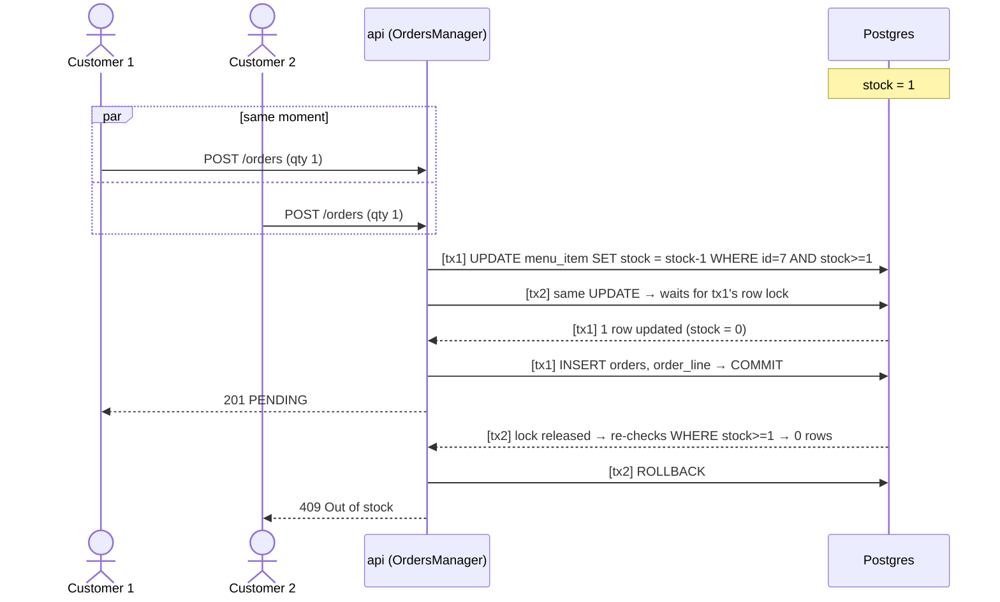
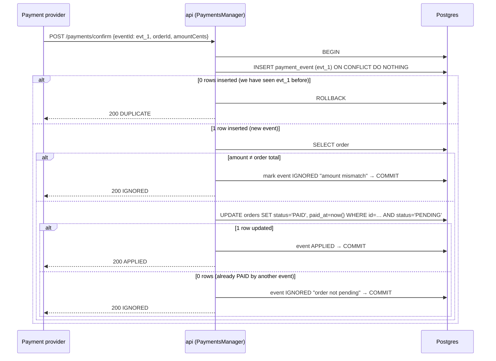
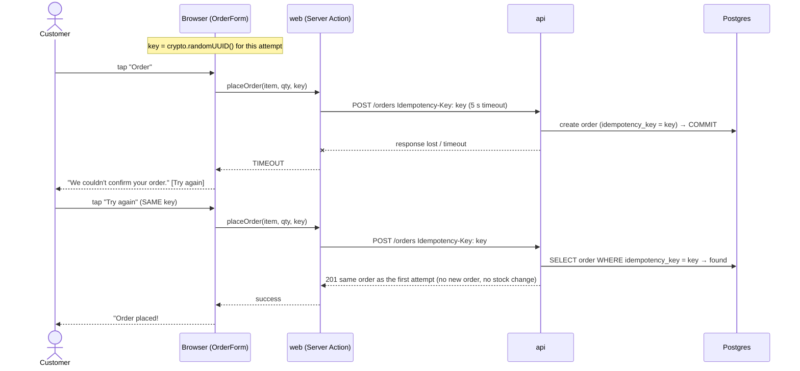
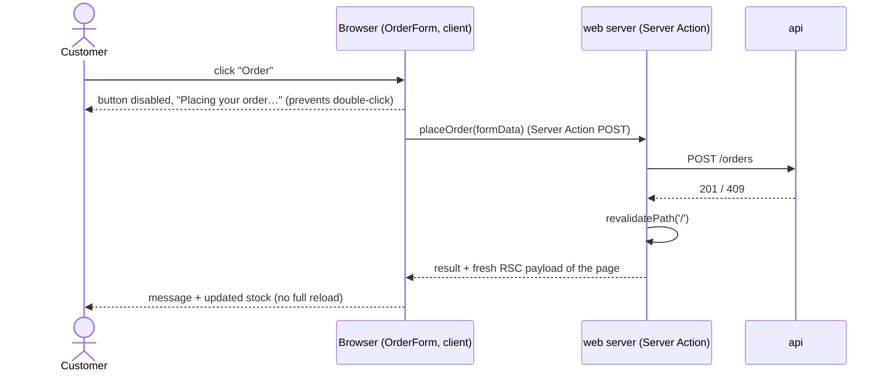

# 03 — Flows and concurrency

## 1. View menu (server-rendered, always fresh)

## 2. Place order: "never sell the last item twice"

**Why this works.** The check (`stock >= 1`) and the write (`stock - 1`) are **one SQL statement**, so there's no gap between "read" and "write" for another request to slip into. Postgres takes a row lock for the UPDATE, so the second transaction waits, and under READ COMMITTED it **re-evaluates the WHERE on the committed row** before updating.

**What we did NOT do, and why:**
- *Read stock, check in code, then write:* the classic race. Both requests read `1`, both write `0`, and two orders exist.
- *`SELECT … FOR UPDATE` then UPDATE:* also correct, but two round-trips and more code for the same guarantee.
- *SERIALIZABLE isolation:* correct, but the losing transaction fails with a serialization error we'd have to retry. More moving parts.
- *Redis lock / queue:* a second system to run, and Postgres already gives us the guarantee.

**Why no RabbitMQ / internal queue?** The Postgres row lock *is* the queue: concurrent orders for the same item line up on the lock and are served one at a time, in milliseconds. A message queue would make ordering **asynchronous**, but the kiosk customer is standing there and needs a yes/no answer now, so we'd have to wait for the queue result anyway. That's more infrastructure for the same outcome. A queue (with the *outbox pattern*) becomes useful for **side effects after payment** (send to kitchen printer, email a receipt), which aren't in scope.

**Multi-line orders:** lines are merged by item and **sorted by `menu_item_id`** before updating, so two orders that touch the same items always lock rows in the same order and can't deadlock. If any line fails, the whole transaction rolls back, so no partial order and no leaked stock.

## 3. Payment confirmation: "exactly once"

**Two layers of protection:**
1. **Same event twice** (a retry): the `UNIQUE(provider_event_id)` index makes the second insert do nothing. If both retries arrive at the same instant, the second insert *waits* on the unique index until the first commits, then does nothing.
2. **Different events for the same order** (e.g. the provider re-issues): the conditional `UPDATE … WHERE status='PENDING'` lets exactly one through. Same trick as the stock decrement.

**Late or out of order:** we never depend on arrival order. Each event is checked against the order's *current* state, and the state only moves forward (`PENDING → PAID`). A confirmation that arrives after the order is already paid can't change anything, and it's recorded as IGNORED for audit.

## 4. Timeout: retry without creating a second order

**The problem:** the request reaches the API and the order is created, but the response is lost (network blip, slow server, timeout). The UI doesn't know if the order exists. If the customer taps again, a naive API would create a **second order** and reserve stock twice.

**The fix: an idempotency key**, the same idea as the payment `eventId`, applied to orders.

Rules:
- The browser keeps **one key per order attempt** and reuses it on "Try again". It makes a **new key** only after a definite answer (success or a 4xx), so the next order is a new order.
- API: inside the order transaction, look up the key first. If found, return that order. If not, reserve stock and create the order with the key. If two requests with the same key race, the `UNIQUE` index lets one win; the loser's transaction rolls back (releasing its stock reservation) and it returns the winner's order.
- The web server calls the API with a **5-second timeout** (`AbortSignal.timeout(5000)`), so the customer is never stuck on a spinner forever.
- **While a retry is pending, the quantity selector is locked.** The key means "this exact order". If the customer could change 2 → 3 and retry with the same key, the API would return the original 2-item order, which is confusing. To order something different, they tap "Start over", which makes a new key.

**Retry policy: manual retries, no hard cap, escalate after 2 failures**
- **No automatic retries** in the Server Action. Each attempt can take up to 5 s, so 3 automatic retries would mean up to 15 s of spinner at a kiosk, which is worse than showing a clear message after 5 s.
- **No hard "max 3" block.** Because of the idempotency key, retrying is always safe, so the retry count has no effect on correctness, only on UX. Blocking the customer after N tries would leave them stuck with no way forward. Human-paced taps also can't overload the API.
- **After the 2nd failure** the message adds "If this keeps happening, please ask staff." That gives an escape route without blocking.
- A max-retry + exponential backoff policy does matter for **machine-to-machine** retries. That's exactly what the payment provider does on its side when calling `/payments/confirm`, and why that endpoint must be idempotent.

## 5. New stock shown after ordering (no rebuild)

The page is revalidated on **failure too** (e.g. 409), so a customer who just lost the race immediately sees the item as "Sold out". The exact messages for every outcome are in [04-ui-states.md](04-ui-states.md).

Other customers' screens pick up changes through `AutoRefresh`, which calls `router.refresh()` every few seconds (see README → Caching).
